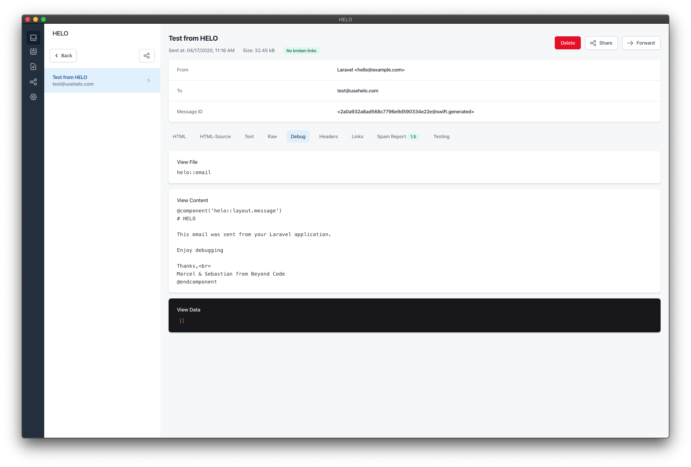

# HELO Laravel

[](https://packagist.org/packages/beyondcode/helo-laravel)
[](https://travis-ci.org/beyondcode/laravel-mailbox)
[](https://scrutinizer-ci.com/g/beyondcode/helo-laravel)
[](https://packagist.org/packages/beyondcode/helo-laravel)

The helper package to add additional debug information from Laravel to your [HELO](https://usehelo.com) mails.

## Documentation

To install this package, require it via composer:

```bash
composer require --dev beyondcode/helo-laravel
```

You can also publish the package configuration using:

```bash
php artisan vendor:publish --provider="BeyondCode\HeloLaravel\HeloLaravelServiceProvider"
```

This will create a config file called `helo.php` with the following content:

```php
<?php

return [
    /**
     * This flag determines if you want to send additional SMTP headers that will contain the debug output that HELO
     * makes use of.
     * By default, this is only the case when your application is in debug mode.
     */
    'is_enabled' => env('HELO_ENABLED', env('APP_DEBUG')),
];
```

## Using the package

When the package is enabled in your Laravel application, all mailables that you send via your application will contain additional SMTP headers with debug information, that [HELO](https://usehelo.com) will display in the UI.
Please refer to the HELO documentation in order to setup your application to send mails to HELO.

Once HELO accepts emails from your application, you can try if the package works, using the built-in test command:

```
php artisan helo:test
```

A test message should appear in your HELO UI containing additional debug information:



### Changelog

Please see [CHANGELOG](CHANGELOG.md) for more information on what has changed recently.

## Contributing

Please see [CONTRIBUTING](CONTRIBUTING.md) for details.

### Security

If you discover any security related issues, please email marcel@beyondco.de instead of using the issue tracker.

## Credits

- [Marcel Pociot](https://github.com/mpociot)
- [All Contributors](../../contributors)

## License

The MIT License (MIT). Please see [License File](LICENSE.md) for more information.
